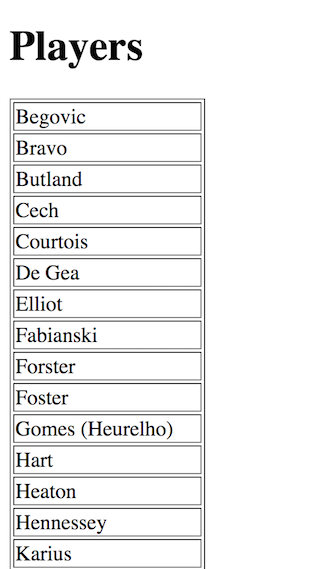
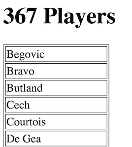

# Underscore Exercise 2 – Collection Functions
		
> Complete ALL the exercises in this section. 

1.	Examine the [players.js](http://localhost/UnderScore/players.js) JSON data file.  

1.	Examine and open the programs ``playerNames.html`` and ``playerNames.js`` 

1.	Using the Underscore ``each()`` function update ``playerNames.js`` to print the name of every player.  Use a `` `` tag to separate each name.

1.	Attempt to have each players name appear inside a HTML table as shown here:

	

1.	Update the ``<h1>`` heading content in the HTML page to print the number of players like this:

	

